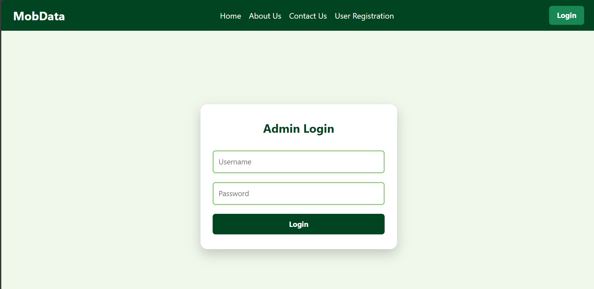
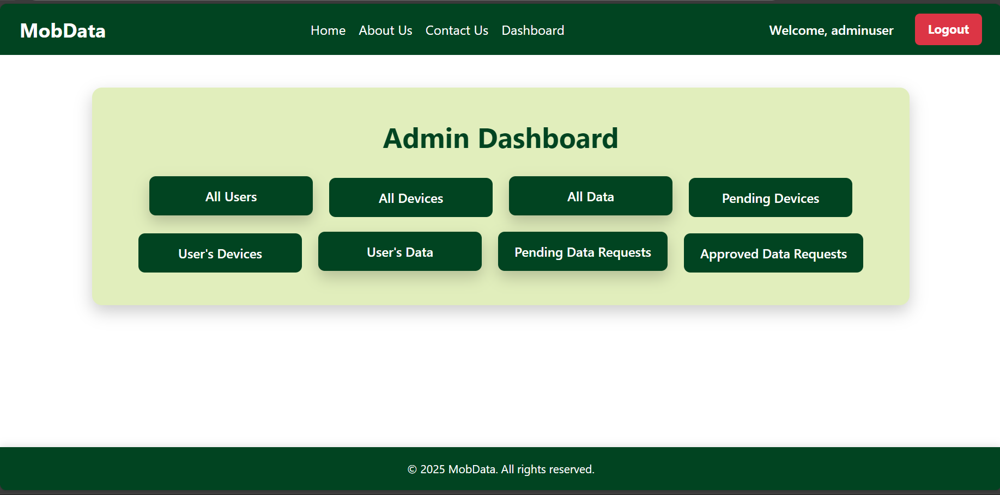
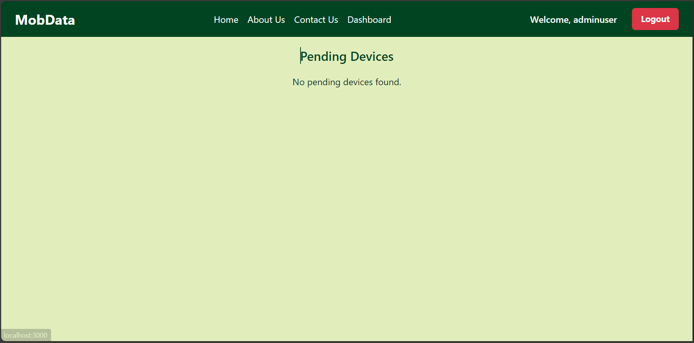
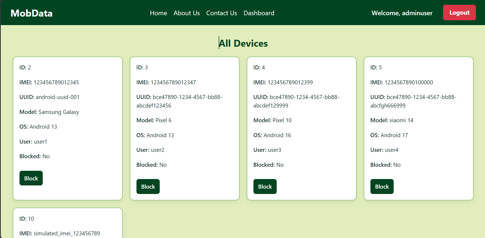
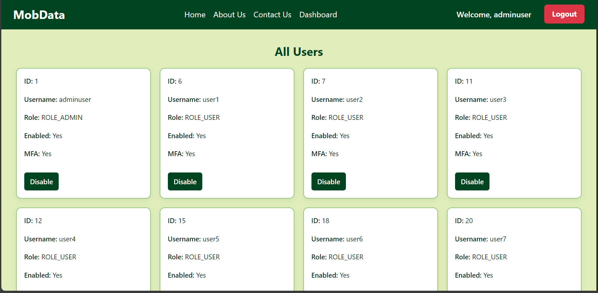
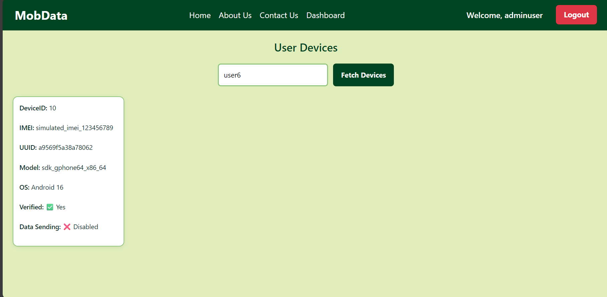

# MobData — Admin Web (React)

A modern admin portal to manage MobData users, devices, and data requests.

## ✨ Features
- Admin authentication (supports MFA-backed backend)
- Pending device approvals (approve / block / unblock)
- View all data requests (pending / approved)
- User & device lists with pagination and filters
- Consistent Royal Green theme

## 🧱 Tech Stack
- React (Vite or CRA)
- React Router
- Axios
- Tailwind/Custom CSS (optional)
- ENV-configurable API base URL

## 🔧 Prerequisites
- Node.js LTS (18+ recommended)
- Backend running (see `../backend/README.md`)

## 🚀 Run Locally
```bash
# Install deps
npm install

npm start     # (CRA)   -> http://localhost:3000

# Build
npm run build

# Preview (Vite)
npm run preview
```

> **API Base URL:** set in `src/services/api.js` or via `.env` (e.g. `VITE_API_BASE_URL=http://localhost:8087`).
> Make sure CORS is allowed in the backend `SecurityConfig` for your dev port.

## 🧭 Routes (adjust to your code)
- `/login`
- `/dashboard`
- `/devices/pending`
- `/devices/all`
- `/requests/pending`
- `/requests/approved`
- `/users`

## 🔐 Auth Notes
- Uses JWT set by backend (HttpOnly cookie or Bearer header).
- On 401/403, redirect to `/login`.
- Include `withCredentials: true` in Axios if using cookies.

## Screenshots
### LOGIN

### DASHBOARD

### PENDING DEVICES

### APPROVED REQUESTS

### ALL DEVICES

### USERS

### DEVICE DETAIL

### THEME SHOWCASE


## 🧪 API Endpoints (example mapping)
- `GET /admin/devices/pending`
- `POST /admin/devices/approve/{deviceId}`
- `POST /admin/devices/block/{id}`
- `GET /admin/data-requests/pending`
- `GET /admin/data-requests/all`
- `POST /admin/data-requests/approve/{requestId}`
- `GET /admin/manage/users`
- `GET /admin/manage/devices`

> Update these to match your actual service functions in `src/services/api.js`.

## ⚙️ ENV Examples
- Vite: create `admin-frontend/.env`
```
VITE_API_BASE_URL=http://localhost:8087
VITE_ENABLE_DEBUG=true
```
- CRA: `REACT_APP_API_BASE_URL=http://localhost:8087`

## 🧹 Lint & Format (optional)
```bash
npm run lint
npm run format
```

## 🧱 Build Artifacts
- Vite output: `dist/`
- CRA output: `build/`

## 📦 Deployment
- Serve the static build behind a reverse proxy; configure CORS & HTTPS to match backend.
