# MobData Backend (Spring Boot 3.5.3)

A secure backend for the MobData system powering the Admin React app and the User React Native app.

## Tech Stack

- **Spring Boot** 3.5.3
- **Spring Security 6** (stateless, JWT)
- **TOTP MFA** (Google Authenticator, QR via ZXing)
- **MySQL** (Hibernate/JPA)
- **Java 17+**
- Mail (SMTP) for email OTP

## Quick Start

### 1) Prerequisites
- Java 17+
- Maven (wrapper included)
- MySQL running locally
- (Optional) Postman for API testing

### 2) Configure database & secrets

Edit `src/main/resources/application.properties`:

```properties
spring.datasource.url=jdbc:mysql://localhost:3306/mobdata_db
spring.datasource.username=YOUR_DB_USER
spring.datasource.password=YOUR_DB_PASS
spring.jpa.hibernate.ddl-auto=update
spring.jpa.properties.hibernate.dialect=org.hibernate.dialect.MySQLDialect
spring.jpa.show-sql=true
spring.jpa.properties.hibernate.format_sql=true

server.port=8087

# --- Security / App ---
app.frontend.base-url=http://localhost:3000

# --- Mail (use env or vault for real secrets!) ---
spring.mail.host=smtp.gmail.com
spring.mail.port=587
spring.mail.username=YOU@example.com
spring.mail.password=APP_PASSWORD
```

> **Important:** Do **not** commit real passwords. Prefer environment variables or a secrets manager. For public GitHub, replace with placeholders as above.

If you prefer env overrides, run with `-Dspring.mail.username=...` etc.

### 3) Run

```bash
./mvnw spring-boot:run
# or
mvn spring-boot:run
```

Server runs on **http://localhost:8087**.

---

## Security & CORS

`SecurityConfig` configures:
- CSRF disabled (stateless)
- CORS allowed from `http://localhost:3000` (Admin UI)
- Stateless JWT via `JwtAuthFilter`
- Route protection:
  - `permitAll`: `/auth/**`, `/email/**`
  - `ROLE_ADMIN`: `/admin/**`
  - `ROLE_USER`: `/data/**`, `/device/**`, `/app/**`

JWT is read from:
- Cookie named `jwt` (preferred), or
- `Authorization: Bearer <token>` header

---

## API Overview

### Auth (`/auth/**`) — public entry points
- **POST** `/auth/register` — Register a new user (username, password, email, ...)
- **POST** `/auth/login` — Login; may prompt for OTP depending on MFA
- **POST** `/auth/setup-mfa` — Generate TOTP secret + QR for Google Authenticator
- **POST** `/auth/verify-otp` — Verify TOTP and issue JWT
- **POST** `/auth/set-new-password` — Force-change password (with OTP) on first login flows
- **POST** `/auth/check` — Auth/session check
- **POST** `/auth/logout` — Clear cookie / token
- **POST** `/auth/send-email-otp` — Send email OTP
- **POST** `/auth/verify-email-otp` — Verify email OTP

### Device (`/device/**`) — requires `ROLE_USER`
- **POST** `/device/register` — Register device (uuid, model, os, location). Generates device token; flags `verified=false`, `dataSendingEnabled=false` by default.
- **GET** `/device/check` — Check device status against logged-in user/jwt
- **GET** `/device/attributes/{username}` — Device attributes by username

### Data (`/data/**`) — requires `ROLE_USER`
- **POST** `/data/request-permission/{deviceId}` — User requests permission to send data for a registered device
- **POST** `/data/submit` — Submit user data (after admin enables data sending)
- **GET** `/data/my-submissions` — List submissions by the current user

### App status (`/app/**`) — requires `ROLE_USER`
- **GET** `/app/user/status/{username}` — Aggregated status for the mobile app (email verified, device approved, data request state, blocked state)

### Admin — requires `ROLE_ADMIN`

**Devices (`/admin/devices/**`)**
- **GET** `/admin/devices/pending` — List pending device registrations
- **POST** `/admin/devices/approve/{deviceId}` — Approve a device
- **POST** `/admin/devices/block/{id}` — Block a device
- **POST** `/admin/devices/unblock/{id}` — Unblock a device

**Data Requests (`/admin/data-requests/**`)**
- **GET** `/admin/data-requests/pending` — Pending data requests
- **GET** `/admin/data-requests/all` — All data requests
- **POST** `/admin/data-requests/approve/{requestId}` — Approve a data request (enables data sending for the device)

**Management (`/admin/manage/**`)**
- **GET** `/admin/manage/users` — Paginated user list
- **GET** `/admin/manage/devices` — Paginated device list
- **GET** `/admin/manage/devices/user/{username}` — Devices by username
- **POST** `/admin/manage/users/disable/{userId}` — Disable user
- **POST** `/admin/manage/users/enable/{userId}` — Enable user

> Role mapping based on `SecurityConfig` and controller annotations.

---

## Typical Mobile Flow (Postman demo)

1. **Register** (optional if pre-seeded): `POST /auth/register`
2. **Login**: `POST /auth/login`
   - If response indicates MFA required, call **Verify OTP** next.
3. **Verify OTP**: `POST /auth/verify-otp` → receives JWT (cookie or header).
4. **Register Device**: `POST /device/register` (uuid, model, os, location)
5. **Admin Approval**: `POST /admin/devices/approve/{deviceId}`
6. **Request Data Permission**: `POST /data/request-permission/{deviceId}`
7. **Admin Approves Data Request**: `POST /admin/data-requests/approve/{requestId}`
8. **Submit Data**: `POST /data/submit`

Use `Authorization: Bearer <JWT>` if not using cookie-based flow.

---

## DTOs / Entities (high level)

- **DTOs**: `AuthRequestDTO`, `DeviceRegisterDTO`, `OtpRequestDTO`, `UserDataDTO`, `UserStatusResponse`, `ForgotPasswordDTO`
- **Entities**: `User`, `DeviceRegistry`, `DeviceDataRequest`, `DeviceDataRequestArchive`, `UserData`
- **Enum**: `Role` (`ROLE_USER`, `ROLE_ADMIN`)

---

## Screenshots to Include

Create a folder: `docs/screenshots/` inside the backend project. Save these with the exact filenames so they auto-reference from this README.

1. **`db-schema.png`** — Tables overview / ERD in MySQL Workbench.
2. **`postman-register.png`** — Successful `/auth/register` request.
3. **`postman-login.png`** — `/auth/login` response (with/without MFA prompt).
4. **`postman-verify-otp.png`** — `/auth/verify-otp` showing success/JWT.
5. **`postman-device-register.png`** — `/device/register` success (token, flags).
6. **`admin-approve-device.png`** — `/admin/devices/approve/{deviceId}` result.
7. **`postman-request-permission.png`** — `/data/request-permission/{deviceId}`.
8. **`admin-approve-data-request.png`** — `/admin/data-requests/approve/{requestId}`.
9. **`postman-submit-data.png`** — `/data/submit` success.
10. **`mfa-qr.png`** — The QR image generated for TOTP (if you export it to a file).
11. **`cookie-or-bearer.png`** — Example showing JWT in cookie vs Authorization header.

## 📸 Screenshots

### Database
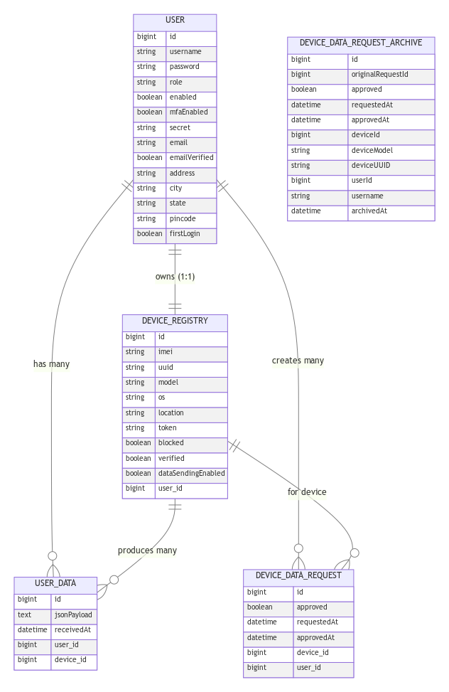

### Authentication Flow
- Register  
  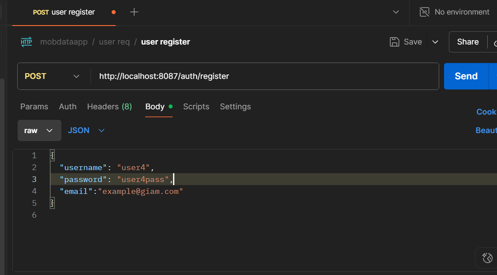

- Login (MFA prompt)  
  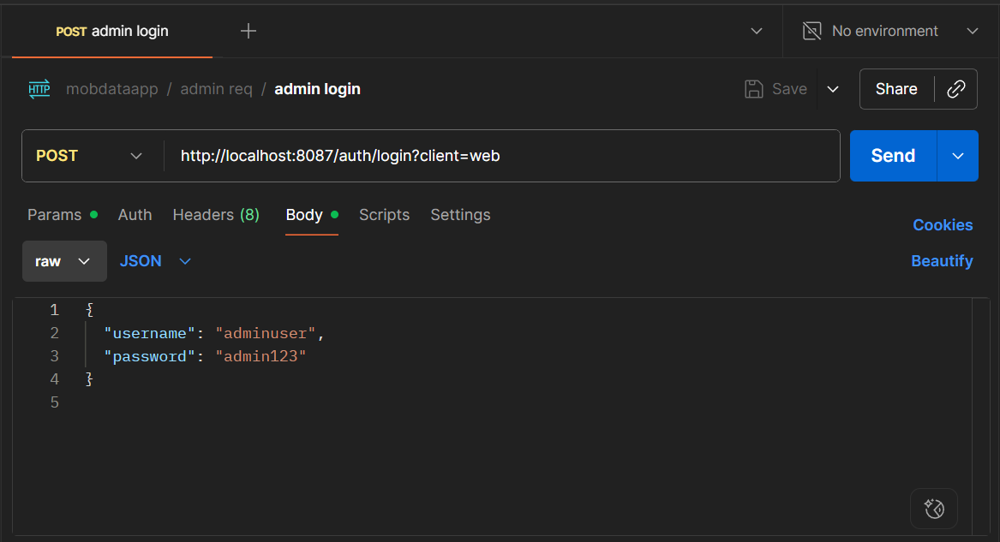

- Verify OTP (JWT issued)  
  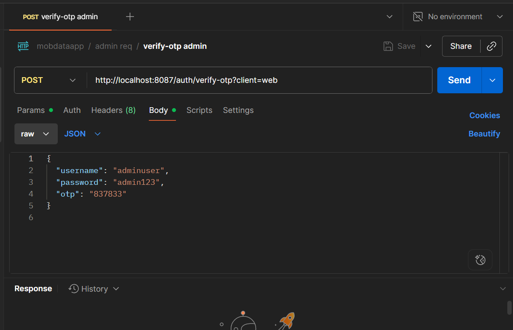

- MFA QR (Setup screen)  
  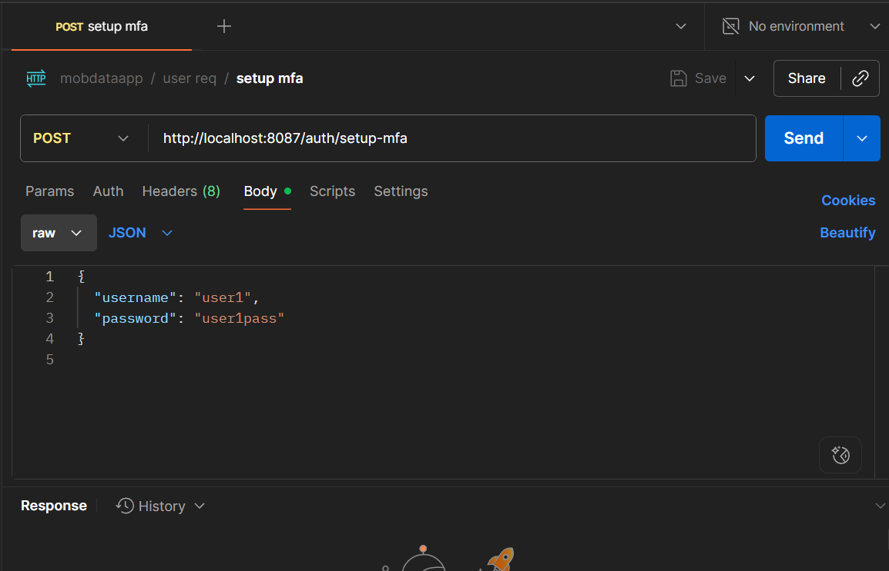

### Device Flow
- Device Register  
  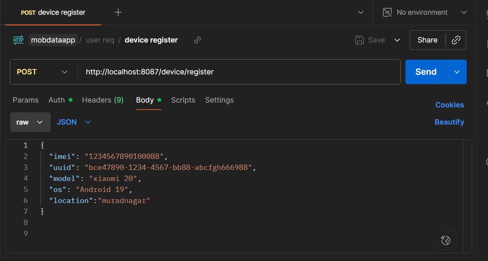

- Admin Approves Device  
  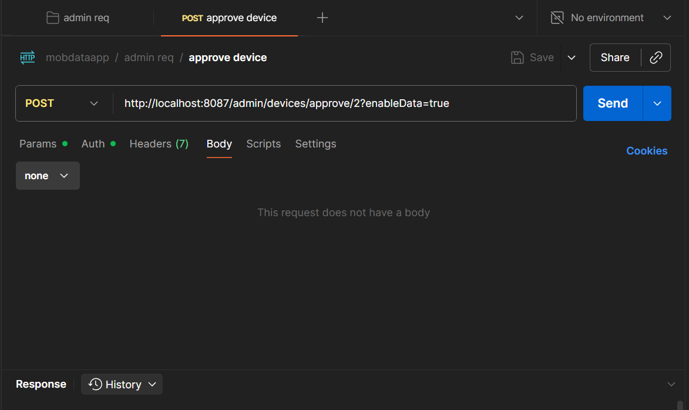

### Data Flow
- User Requests Permission  
  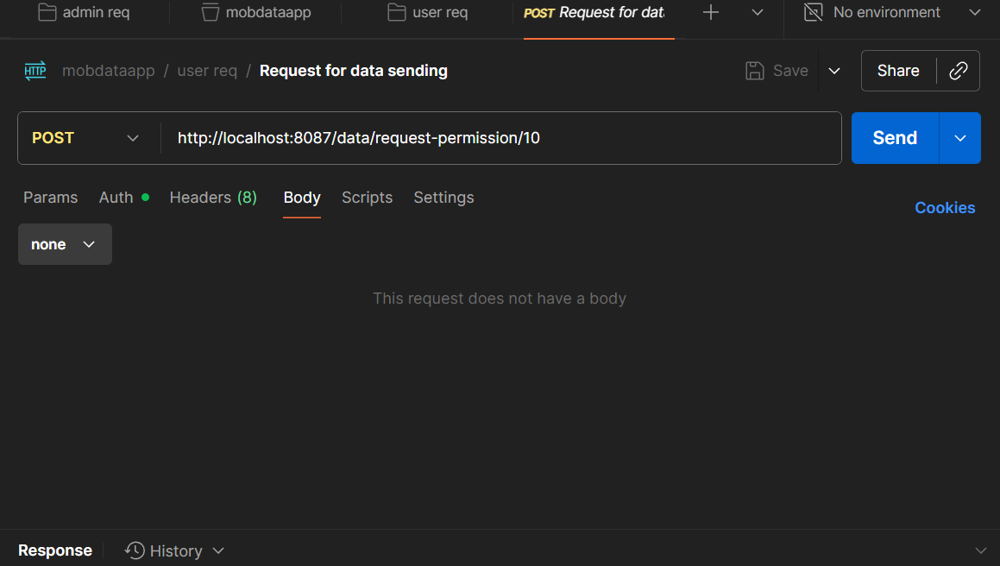

- Admin Approves Data Request  
  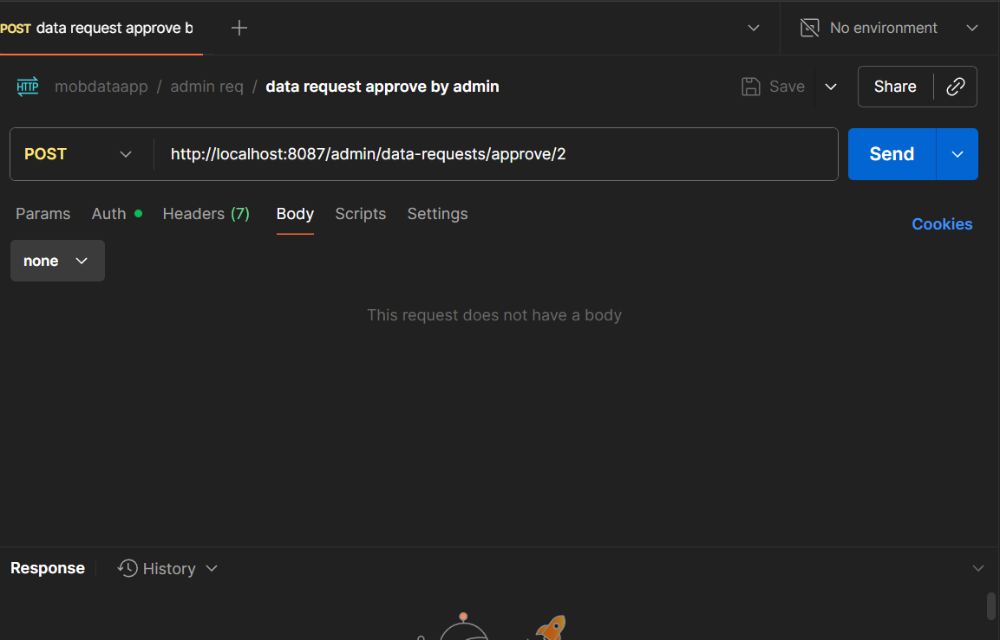

- Data Submission  
  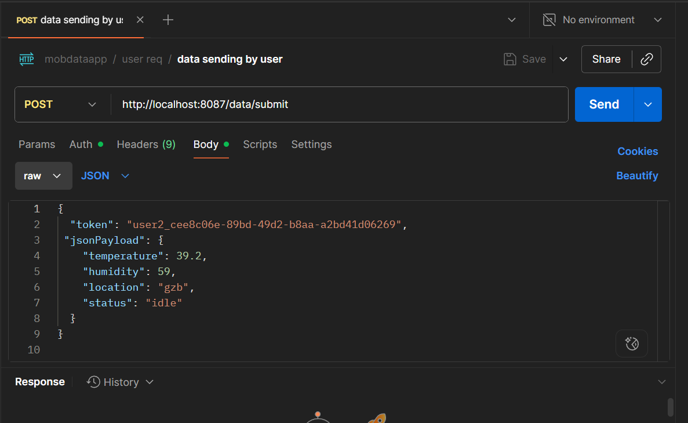

### JWT Usage
- Cookie vs Authorization Header  
  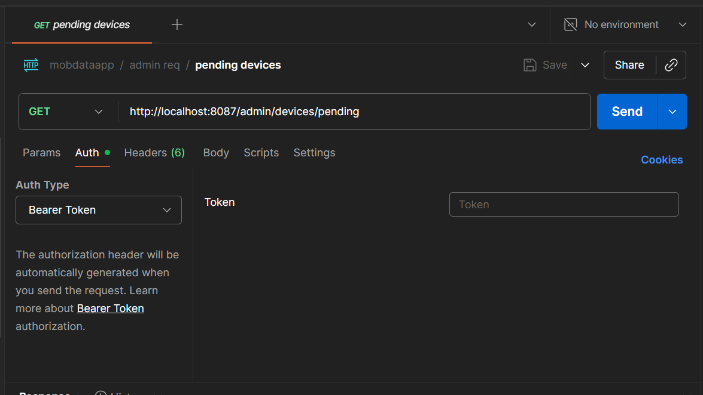

## Build

```bash
./mvnw clean package
# jar at target/mobdata-0.0.1-SNAPSHOT.jar
```

Run as a jar:

```bash
java -jar target/mobdata-0.0.1-SNAPSHOT.jar   --spring.datasource.username=YOUR_DB_USER   --spring.datasource.password=YOUR_DB_PASS
```

---

## Notes & Best Practices

- **Secrets**: Never commit real SMTP passwords or JWT secrets. Use env variables.
- **JWT**: Cookie (`jwt`) or `Authorization` header supported via `JwtUtil`.
- **CORS**: If Admin UI runs on a different port (e.g., 5173), add it to allowed origins in `SecurityConfig`.
- **Migrations**: For teams, prefer Flyway/Liquibase over `ddl-auto=update`.
- **Indexes/Uniqueness**: Ensure device uniqueness (uuid/IMEI) and user constraints in DB.
- **Logging**: Disable `show-sql` in production.


