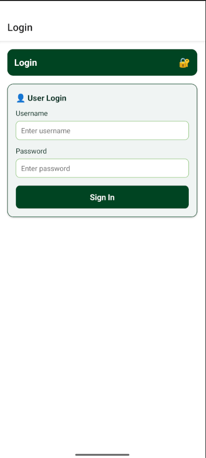
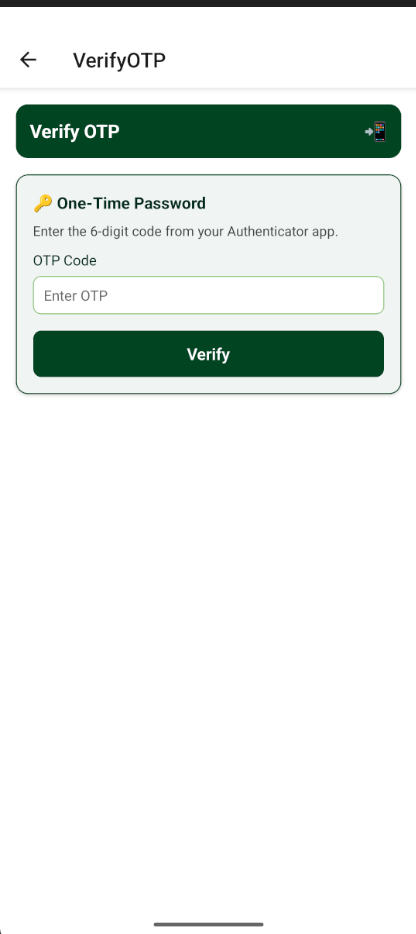
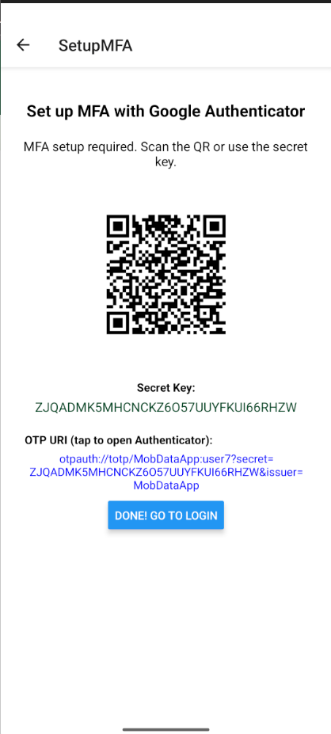
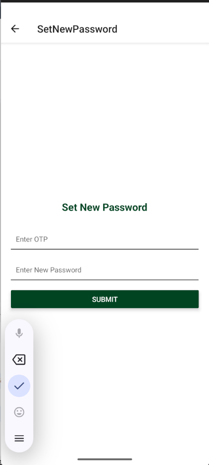
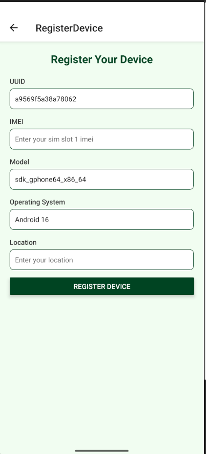
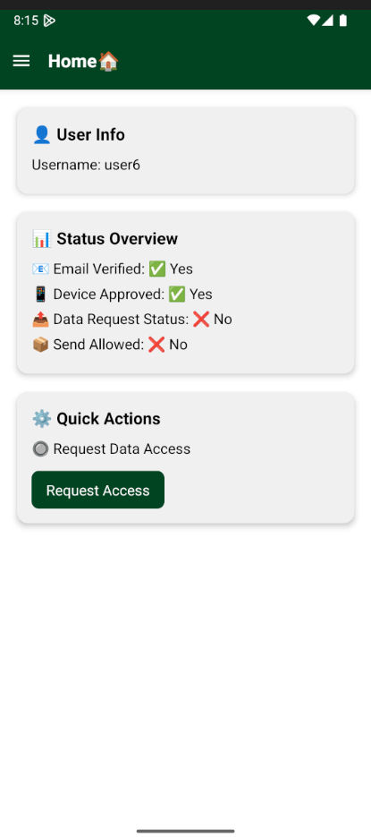
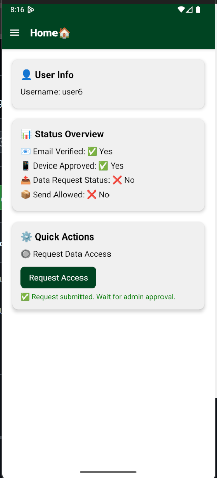
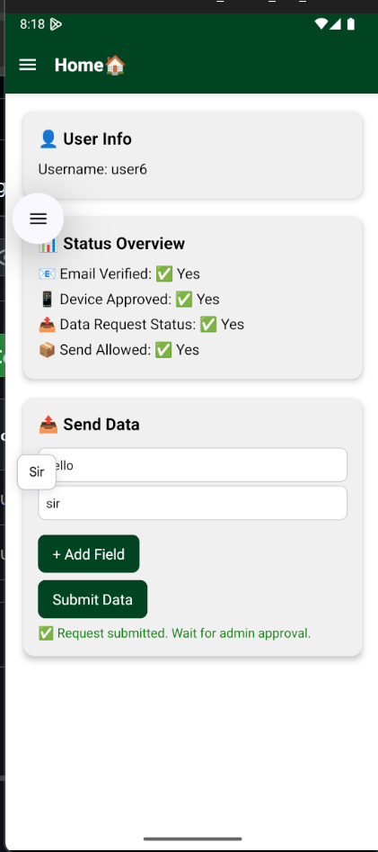

# MobData — User Mobile App (React Native)

This is the **user-facing mobile app** for MobData. It connects to the MobData Spring Boot backend and supports:
- Login with MFA (TOTP)
- First‑login password change (if enforced by backend)
- Device registration (UUID/IMEI/model)
- Viewing status (email verified, device approved, data request state)
- Requesting permission to send data and submitting data once approved

## 🚀 Quick Start

### 1) Prerequisites
- Node.js LTS (18+ recommended)
- JDK 17+ (for Android builds)
- Android Studio (emulator) or Xcode (iOS simulator)
- Backend running (see `../backend/README.md`)

### 2) Install dependencies
```bash
npm install
```

### 3) Configure the API base URL
Edit **`services/api.js`** (or your API config file) and set the backend base URL:

```js
// services/api.js (example)
export const BASE_URL = "http://10.0.2.2:8087"; // Android emulator
// iOS simulator can usually use: "http://localhost:8087"
// Physical device: use your PC's LAN IP, e.g. "http://192.168.1.5:8087"
```

> **Android emulator note:** use `http://10.0.2.2:<PORT>` instead of `http://localhost` to reach the host machine.

### 4) Run the app
```bash
# Start Metro bundler
npx react-native start

# In another terminal, run on Android
npx react-native run-android

# or run on iOS (macOS only)
npx react-native run-ios
```

If you prefer npm scripts, add these to `package.json`:
```json
{
  "scripts": {
    "start": "react-native start",
    "android": "react-native run-android",
    "ios": "react-native run-ios"
  }
}
```

## 📁 Project Structure (high-level)
```
user-mobile/
├─ assets/                      # images, icons, etc.
├─ screens/                     # Login, VerifyOTP, SetupMFA, RegisterDevice, Status, SendData...
├─ services/                    # api.js (Axios instance / fetch helpers)
├─ App.js                       # Entry; sets up navigation
├─ DrawerNavigator.js           # Drawer / stack navigator
├─ index.js, app.json
├─ babel.config.js, metro.config.js, jest.config.js
├─ package.json, package-lock.json
└─ README.md, .gitignore
```

## 🔐 Auth & Flow (expected)
1. **Login** → if MFA enabled, backend returns a prompt to **verify TOTP**.
2. **Verify OTP** (`/auth/verify-otp`) → app stores token via Axios headers or cookie fallback.
3. **First Login Force Password Change** (if required by backend).
4. **Register Device** → submit UUID/IMEI/model; device starts as `verified=false`.
5. **Admin Approves Device** → status endpoint should reflect `verified=true`.
6. **Request Data Permission** → admin approves request → device allowed to send data.
7. **Send Data** → only after approval.

## ⚙️ Environment & Config
If you later add `react-native-config`, you can keep secrets and base URLs in `.env`:
```
API_BASE_URL=http://10.0.2.2:8087
```
But by default this project expects a constant in `services/api.js`.

## 🧪 API Integration (typical endpoints)
- `POST /auth/login`
- `POST /auth/verify-otp`
- `POST /auth/set-new-password`
- `POST /device/register`
- `GET /app/user/status/{username}`
- `POST /data/request-permission/{deviceId}`
- `POST /data/submit`

## 🖼️ Screenshots
### LOGIN
  
### VERIFY OTP
  
### SETUP MFA
  
### SET NEW PASSWORD
  
### REGISTER DEVICE
  
### STATUS
  
### REQUEST PERMISSION
  
### SEND DATA
  


## 🧹 Cleaning Unused Files
- Remove boilerplate screens not in use.
- Remove unused images in `assets/`.
- Keep dependencies minimal in `package.json`.

## ❗ Troubleshooting
- **Android cannot reach backend** → use `10.0.2.2` and verify device & PC are on the same network (for physical devices).
- **CORS / Unauthorized** → ensure backend CORS allows your origin / device and that you send the JWT (Bearer) from the app.
- **Build errors on a fresh clone** → run `npm install`, then clean caches: `cd android && ./gradlew clean` (macOS/Linux) or from Android Studio.


